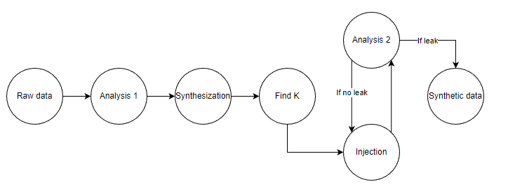
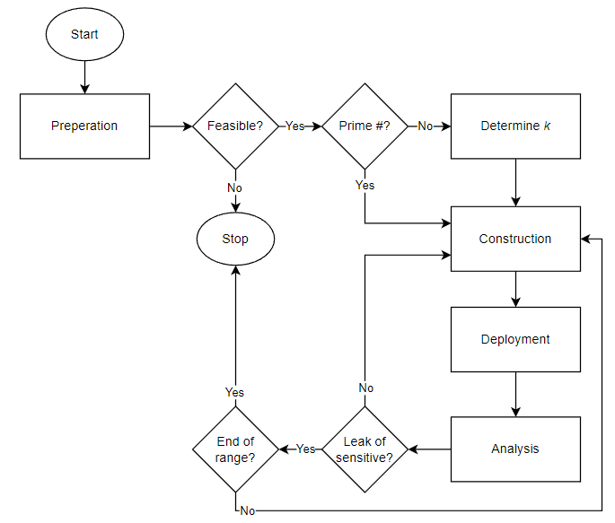

# SDS-attack-pipeline
A Python pipeline tool for analysis and attacks (data poisoning) on the SDS (k-anonymity) synthesis

## Prerequisites
- Microsoft's Synthetic Data Showcase libraries; core, lib-python and python-pipeline.
- Pandas.
- Numpy.
- NIST dataset found [here](https://github.com/usnistgov/SDNist/tree/main/nist%20diverse%20communities%20data%20excerpts/national).

## Usage
- Install SDS dependencies into the project root:
  - Download and install `core` library [here](https://github.com/microsoft/synthetic-data-showcase/tree/main/packages/core).
  - Download and install `lib-python` library [here](https://github.com/microsoft/synthetic-data-showcase/tree/main/packages/python-pipeline).
  - Download and install `python-pipeline` [here](https://github.com/microsoft/synthetic-data-showcase/tree/main/packages/python-pipeline).
- Set the required configurations in `Config.ini`, including:
  - `dataset_path` an absolute path to the sensitive dataset.
  - `name` to set the prefix of generated files.
  - `root_dir` specifies the directory where files are generated.
- Other optional configurations in `Config.ini`:
    - verbose logging output (includes logging from all sources).
    - logging level and formatting.
- Run main program `SDS-attack-pipeline` through IDE or commandline:
  - Using the command: `python SDS-attack-pipeline.py`, when located in the `.../SDS-attack-pipeline/src` folder.
- Supply inputs:
  -  `n` - the number of rows.
  -  `m` - the number of columns.
  -  `cols` - the specific name(s) of column(s) to use seperated by spaces (optional).
  -  `k` - the privacy resolution for synthesis (k).
  -  `sensitive_attribute` - the name of the sensitive attribute (must be in the _m_ columns).
  - `known_attributes` - the name(s) of the known attributes seperated by spaces (optional) (must be in the _m_ columns).

When `known_attributes` is not given, the attack will assume knowledge of all non-sensitve attrbites.

Directories and files will be generated at the project root; `/SensitiveDataset`, `/SynthesisConfig` and `/SyntheticDataset` carrying the corresponding files.

## Structure of the pipeline

## Flow of attack
